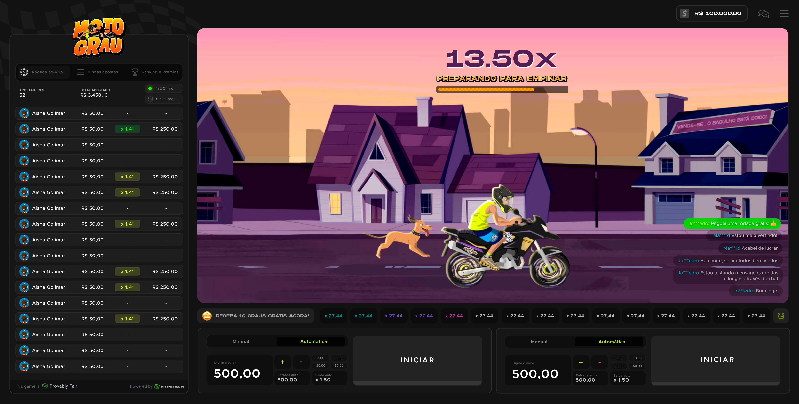

#  Unity Multiplayer Test



---
## Summary:

- [About the project](#about-the-project)
- [Getting started](#getting-started)
    - [Cloning the repository](#cloning-the-repository)
    - [Testing](#testing)

---

## About the project

UI/UX Test is an awnser to a knowledge test about Front-End web development with React, TypeScript, JavaScript and CSS based on the bet game "Moto-Grau"

You can read the Requirements Document (pt-br) [here]([documentation/documents/requirements-pt-br.jpg](https://github.com/hypetechgames/frontend-challenge))


The base project contains a Phaser game within a webpage. The webpage incorporates various features related to the game state and its controllers.

The challenge objective is to use creativity to enhance the UX of the base project in any way.

The base project has several areas for improvement regarding the "game feel." I aimed to enhance the UX by aligning the webpage more closely with that feel and improving its game feedback.

The game code on the webpage was minified. Consequently, I recreated the game using Phaser 3 to have full control over the game cycle. I then implemented smoother feedback for all interactions in the game.

I also introduced new content into the game, which was initially on the webpage, such as the "multiplier counter," "start countdown," and "driver fell warning." This allowed me to enhance its feedback in a more gamified manner. Subsequently, I removed the original content from the webpage.

At this point, there was no longer sufficient time to modify the UI of the webpage safely. However, I had already invested time in a change I considered essential for the website to align with the game's experience. This involved transforming the main "bet/withdraw" button into one that resembled a game, sinking when held, along with its content, the text "bet/withdraw." While seemingly a simple task, it proved to be a significant challenge. It needed to be TRULY REUSABLE, modular, and testable in isolation, separate from the main project logic and business rules. Additionally, it had to be usable by a component as if it were a traditional "button" element.


I isolated the "Game-Button" and the new game "Moto-Grau" so that they could be tested independently in what I refer to as a "Showcase Scene." This provides a way to test features in isolation without relying on the rest of the project, similar to unit testing for aspects that cannot be tested conventionally (typically, visual elements).


---

### Getting Started:

##### Cloning the repository:

To open the project in development mode, you need to have an environment configured with [Yarn](https://yarnpkg.com/getting-started/install)


``` 
git clone https://github.com/joveem/challenge-02-hypetech-front-end.git
cd challenge-02-hypetech-front-end
yarn
#
```

##### Installing dependencies:

(with NPM)

``` 
npm install
```
(with Yarn)

``` 
yarn
```

##### Running:

```
yarn dev
```

##### Paste ALL this code in a command line to clone and run the server at once:

``` 
# Clone the repository:
git clone https://github.com/joveem/challenge-02-hypetech-front-end.git
# Directory changing
cd challenge-02-hypetech-front-end
# Install dependencies:
yarn
# Start Server:
yarn dev
#
```

### Testing:

To access the game, it is necessary to obtain an access token that creates a functional demo session for development

##### Obtendo um token de acesso ao jogo

1 - Access the Demo API: https://hypetech-demo-api-service-developer.up.railway.app/docs/

2 - Get a demo link:

```json
	{ "gameUrl": "https://hypetech-games-ui-developer.up.railway.app/44cdf4cec80508c531f71a1929d591c8" }
```

3 - Extract the obtained token: (in this example, was "44cdf4cec80508c531f71a1929d591c8)


**Note:** For each game you want to load, you must generate a new token, changing the "game" parameter of the request:

 ```json
 {
	 "game": "motograu",
		"lang": "pt",
		"currency": "BRL"
 }
```

 ```json
 {
	 "game": "wall-street",
		"lang": "pt",
		"currency": "BRL"
 }
```

4 - Access the game: once you have obtained the token, use it in your development environment:

**Example - URL of your environment:** http://localhost:8000/

**Example - URL of the game in your environment:** http://localhost:8000/2b29acad3f7a1e6b0995155668719e66

If you encounter difficulty obtaining the token following the above process, you can use the public tokens below *(aware that other developers may be using the same session at the same time)*:

**Motograu:** 44cdf4cec80508c531f71a1929d591c8
**WallStreet:** 294f24f2c661fc80fd6d12845a3ccdd6

---
